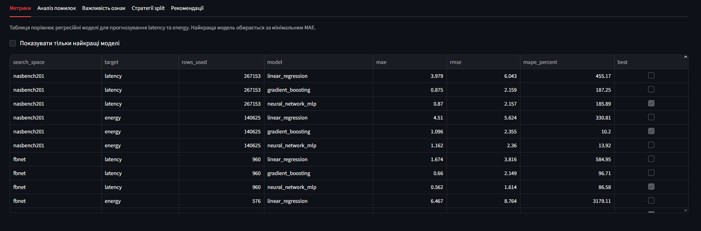
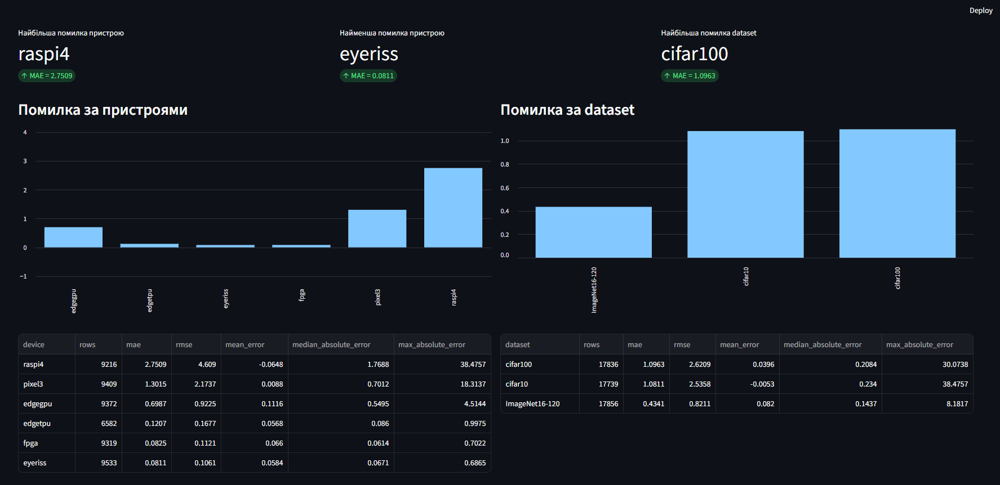
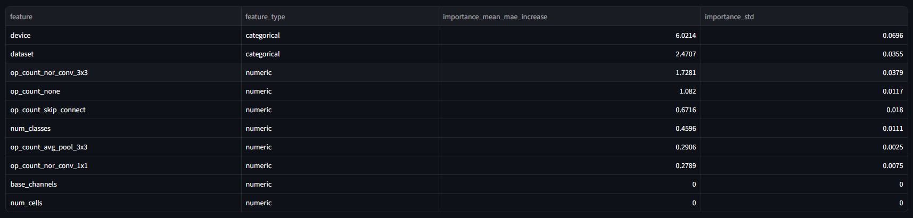
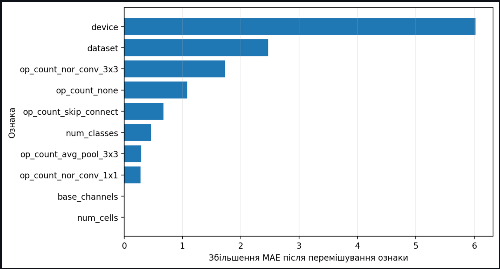
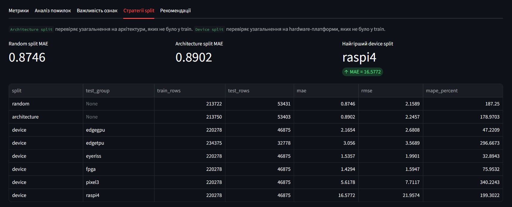
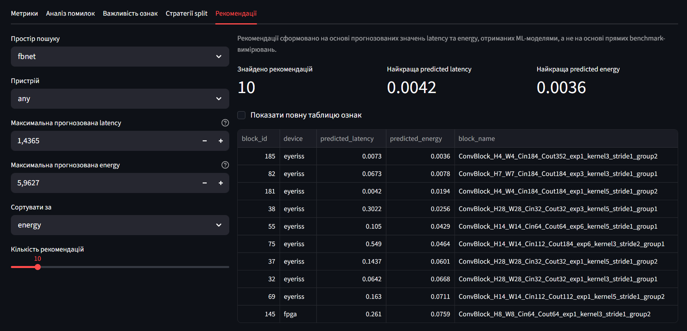

# Прогнозування продуктивності нейронних мереж на edge-пристроях

Репозиторій бакалаврського проєкту за темою:

**Метод та програмні засоби прогнозування продуктивності нейронних мереж на гетерогенних edge-пристроях з обмеженими обчислювальними ресурсами**

У проєкті використовується датасет HW-NAS-Bench для побудови pipeline машинного навчання, який прогнозує latency та енергоспоживання нейронних мереж під час inference на гетерогенних edge-пристроях.

## Поточний обсяг роботи

Поточна реалізація охоплює:

- розбір benchmark-даних HW-NAS-Bench у форматі `.pickle`;
- експорт benchmark-даних у табличний CSV-формат;
- аналіз структури датасету та цільових змінних;
- навчання та порівняння моделей прогнозування latency та energy:
  - Linear Regression;
  - Gradient Boosting;
  - MLP neural network;
- збереження найкращих моделей прогнозування та метрик оцінювання;
- аналіз помилок за пристроями та датасетами;
- аналіз внеску ознак у прогнозування;
- рекомендації конфігурацій розгортання за заданими обмеженнями latency та energy;
- демонстраційний Streamlit-інтерфейс для перегляду результатів і рекомендацій.

Основною цільовою змінною є `latency`. Поле `energy` доступне лише для частини пристроїв, тому моделі енергоспоживання навчаються на відфільтрованій підмножині записів.

## Структура проєкту

```text
data/
  raw/
    HW-NAS-Bench-v1_0.pickle        # оригінальний benchmark-файл, не змінюється
  processed/
    hwnasbench_nasbench201.csv      # експортована таблиця NASBench201
    hwnasbench_fbnet.csv            # експортована таблиця FBNet

models/
  nasbench201_latency_predictor.pkl # найкраща модель для NASBench201 latency
  fbnet_latency_predictor.pkl       # найкраща модель для FBNet latency
  nasbench201_energy_predictor.pkl  # найкраща модель для NASBench201 energy
  fbnet_energy_predictor.pkl        # найкраща модель для FBNet energy

notebooks/
  01_dataset_analysis.ipynb          # аналіз датасету
  02_model_training_validation.ipynb # тренування та валідація моделей

reports/
  nasbench201_latency_metrics.json  # метрики NASBench201 latency
  fbnet_latency_metrics.json        # метрики FBNet latency
  nasbench201_energy_metrics.json   # метрики NASBench201 energy
  fbnet_energy_metrics.json         # метрики FBNet energy
  error_*.csv                       # аналіз помилок baseline
  feature_importance.csv            # аналіз внеску ознак
  split_strategy_results.csv        # порівняння train/test split
  recommendations_*.csv             # результати підбору конфігурацій
  plots/

src/
  inspect_hwnasbench.py             # виводить структуру pickle-файлу
  export_hwnasbench_csv.py          # експортує pickle-дані у CSV
  train_performance.py              # навчає та оцінює latency/energy-моделі
  analyze_baseline_errors.py        # аналізує помилки NASBench201 baseline
  analyze_feature_importance.py     # оцінює внесок ознак
  evaluate_split_strategies.py      # порівнює split-стратегії
  recommend_config.py               # рекомендує конфігурації за latency/energy

app.py                              # Streamlit-інтерфейс проєкту
EXPERIMENTS.md                      # журнал експериментів і висновків
requirements.txt
```

## Опис основних файлів

- `app.py` запускає демонстраційний сайт на Streamlit. Інтерфейс об'єднує таблиці метрик, аналіз помилок, важливість ознак, порівняння split-стратегій і модуль рекомендацій.
- `src/train_performance.py` навчає три регресійні моделі для вибраного простору пошуку (`nasbench201` або `fbnet`) і цільової змінної (`latency` або `energy`).
- `src/recommend_config.py` використовує навчені моделі latency та energy, прогнозує показники для доступних конфігурацій і повертає найкращі варіанти за заданими обмеженнями.
- `src/analyze_baseline_errors.py` формує аналіз помилок NASBench201 baseline за окремими пристроями та датасетами.
- `src/analyze_feature_importance.py` оцінює важливість ознак методом permutation importance.
- `src/evaluate_split_strategies.py` порівнює якість моделі при random split, architecture split і device split.
- `EXPERIMENTS.md` містить журнал проведених експериментів, таблиці результатів і короткі висновки.

## Налаштування середовища

Створіть і активуйте Python virtual environment, після чого встановіть залежності:

```bash
pip install -r requirements.txt
```

Поточний код перевірявся з локальним virtual environment у `.venv`.

## Підготовка датасету

Оригінальний файл HW-NAS-Bench потрібно розмістити за шляхом:

```text
data/raw/HW-NAS-Bench-v1_0.pickle
```

Для перегляду структури сирого benchmark-файлу:

```bash
python src/inspect_hwnasbench.py
```

Для експорту benchmark-даних у CSV:

```bash
python src/export_hwnasbench_csv.py
```

У результаті створюються CSV-файли:

- `data/processed/hwnasbench_nasbench201.csv`
- `data/processed/hwnasbench_fbnet.csv`

## Навчання моделей

Для навчання моделей прогнозування latency:

```bash
python src/train_performance.py --search-space nasbench201 --target latency
python src/train_performance.py --search-space fbnet --target latency
python src/train_performance.py --search-space nasbench201 --target energy
python src/train_performance.py --search-space fbnet --target energy
```

Скрипт фільтрує невалідні записи з `latency <= 0`, навчає три моделі, оцінює їх на тестовій вибірці та зберігає:

- моделі в `models/`;
- метрики в `reports/*_metrics.json`.

Для глибшого аналізу NASBench201 baseline:

```bash
python src/analyze_baseline_errors.py
python src/analyze_feature_importance.py
python src/evaluate_split_strategies.py
```

## Recommendation module

Для підбору конфігурацій за прогнозованими `latency` та `energy`:

```bash
python src/recommend_config.py --search-space nasbench201 --max-latency 5 --max-energy 20 --sort-by energy --top-n 10
python src/recommend_config.py --search-space fbnet --max-latency 1 --max-energy 5 --sort-by latency --top-n 10
```

Скрипт використовує навчені моделі `*_latency_predictor.pkl` та `*_energy_predictor.pkl`, фільтрує фізично неможливі прогнози `<= 0` і зберігає рекомендації у `reports/recommendations_*.csv`.

## Демонстраційний сайт

Для запуску Streamlit-інтерфейсу:

```bash
streamlit run app.py
```

Якщо використовується локальне середовище `.venv`:

```bash
.venv\Scripts\python.exe -m streamlit run app.py
```

Після запуску сайт доступний за адресою:

```text
http://localhost:8501
```

Функціонал сайту:

- перегляд метрик моделей для `NASBench201` і `FBNet`;
- фільтрація таблиці метрик за найкращими моделями;
- аналіз помилок прогнозування за пристроями та датасетами;
- перегляд важливості ознак і графіка permutation importance;
- порівняння random, architecture та device split-стратегій;
- інтерактивний підбір рекомендованих конфігурацій за обмеженнями latency, energy, device і dataset;
- відображення компактної або повної таблиці рекомендованих конфігурацій.

### Вкладка "Метрики"



Вкладка "Метрики" показує порівняльну таблицю регресійних моделей для просторів пошуку `NASBench201` і `FBNet`. Для кожної комбінації `search_space` та цільової змінної `target` відображаються кількість використаних записів, назва моделі, значення `MAE`, `RMSE`, `MAPE` та позначка `best` для моделі з найменшою помилкою MAE. Чекбокс "Показувати тільки найкращі моделі" дозволяє швидко залишити в таблиці лише найкращі результати для кожного експерименту.

### Вкладка "Аналіз помилок"



Вкладка "Аналіз помилок" показує, на яких пристроях і датасетах модель прогнозування latency має найбільше відхилення. У верхній частині виводяться короткі summary-метрики: пристрій з найбільшою помилкою, пристрій з найменшою помилкою та датасет з найбільшою помилкою. Нижче розміщено два bar chart: помилка за пристроями та помилка за dataset. Таблиці під графіками деталізують кількість записів, `MAE`, `RMSE`, середню помилку, медіанну абсолютну помилку та максимальну абсолютну помилку для кожної групи.

### Вкладка "Важливість ознак"





Вкладка "Важливість ознак" відображає результат permutation importance для baseline-моделі NASBench201 latency. Таблиця містить назву ознаки, її тип, середнє збільшення MAE після випадкового перемішування ознаки та стандартне відхилення цього збільшення. Горизонтальний графік показує ті самі ознаки у спадному порядку впливу. Найбільший внесок має `device`, що підтверджує сильну залежність latency від апаратної платформи. Далі йдуть `dataset` та архітектурні ознаки, зокрема кількість операцій `nor_conv_3x3`, `none` і `skip_connect`.

### Вкладка "Стратегії split"



Вкладка "Стратегії split" порівнює різні способи формування train/test-вибірки для NASBench201 latency. `Random split` оцінює стандартне випадкове розбиття записів. `Architecture split` перевіряє узагальнення на архітектури, яких не було у train. `Device split` перевіряє перенесення моделі на hardware-платформи, яких не було у train. Summary-блоки показують MAE для random split, MAE для architecture split і найгірший device split. Таблиця нижче деталізує для кожного сценарію кількість train/test-записів та метрики `MAE`, `RMSE`, `MAPE`. На поточних результатах видно, що architecture split майже не погіршує якість порівняно з random split, але device split значно складніший, особливо для `raspi4`.

### Вкладка "Рекомендації"



Вкладка "Рекомендації" реалізує інтерактивний підбір конфігурацій розгортання. У лівій панелі користувач обирає простір пошуку (`nasbench201` або `fbnet`), пристрій, обмеження на прогнозовані `latency` та `energy`, критерій сортування і кількість рекомендацій. У правій частині відображаються результати, сформовані на основі прогнозів навчених ML-моделей, а не прямих benchmark-вимірювань. Summary-блоки показують кількість знайдених рекомендацій, найкращу predicted latency та найкращу predicted energy. Таблиця нижче містить рекомендовані конфігурації з прогнозованими значеннями та основними ідентифікаторами архітектури або FBNet-блоку. Чекбокс "Показати повну таблицю ознак" дозволяє перейти від компактного представлення до повного набору характеристик.

## Поточні результати baseline-експерименту

Основні експерименти прогнозують `latency` та `energy` для `NASBench201` і `FBNet`.

| Search space | Target | Best model | MAE | RMSE |
| --- | --- | --- | ---: | ---: |
| NASBench201 | latency | MLP Neural Network | 0.87 | 2.16 |
| NASBench201 | energy | Gradient Boosting | 1.10 | 2.36 |
| FBNet | latency | MLP Neural Network | 0.56 | 1.61 |
| FBNet | energy | Gradient Boosting | 2.57 | 4.98 |

Для NASBench201 також додано аналіз помилки за пристроями/datasets, аналіз внеску ознак і порівняння split-стратегій.

## Примітки

- `latency` доступна для всіх експортованих записів.
- `energy` відсутня для частини пристроїв, тому її потрібно аналізувати на відфільтрованій підмножині даних.
- `MAPE` є нестабільною метрикою для цього датасету, оскільки частина значень latency дуже мала.
